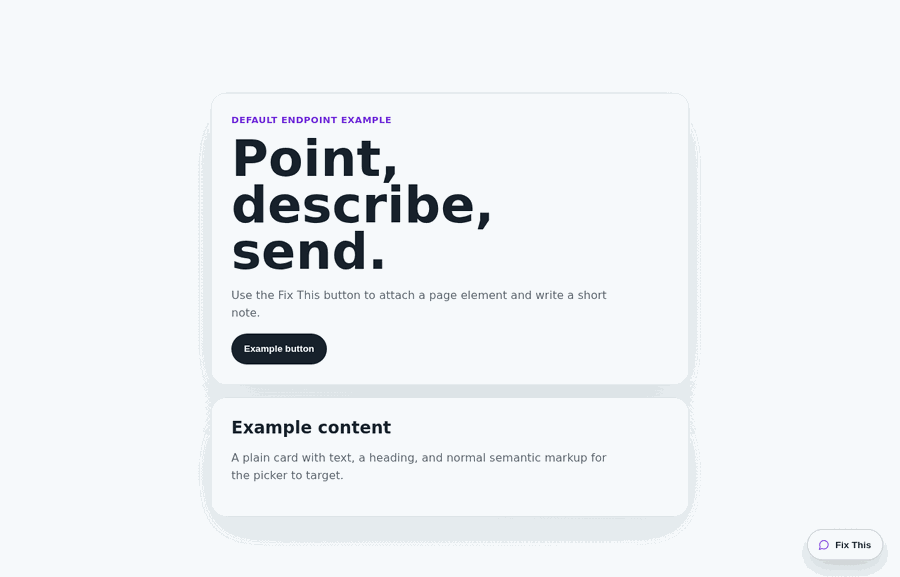

# Official "fix-this"-widget

[](https://www.npmjs.com/package/fix-this-widget)
[](./LICENSE)

A tiny React widget for turning vague UI feedback into actionable fix requests, ready to route into coding agents or your own triage flow.

Users click **Fix This**, write a note, optionally point at the broken element, and your app receives page context, viewport data, scroll position, timestamp, and selected-element metadata.

No screenshots. No full DOM dump. No feedback portal ceremony.



## What you get

- Floating React feedback widget with TypeScript types
- Optional element picker, no required app markup
- Default POST target at `/api/fix-this-widget/feedback`
- Next.js route helper that writes JSONL for quick internal testing
- Custom `submitFeedback` hook for databases, queues, issue trackers, Slack, Linear, GitHub Issues, coding agents, or your own API
- React 18 and 19 support

## Install

```bash
npm install fix-this-widget
```

Render the widget from a client-rendered React surface:

```tsx
'use client';

import { FixThisWidget } from 'fix-this-widget';
import 'fix-this-widget/styles.css';

export function FeedbackWidget() {
  return <FixThisWidget />;
}
```

By default, submissions post to `/api/fix-this-widget/feedback`.

## Add a backend

For Next.js App Router, add the default JSONL endpoint:

```ts
// app/api/fix-this-widget/feedback/route.ts
import { createFixThisWidgetHandler } from 'fix-this-widget/server';

export const POST = createFixThisWidgetHandler();
```

Valid requests are appended to `feedback/fix-this-widget.jsonl` relative to your app working directory.

```ts
export const POST = createFixThisWidgetHandler({
  filePath: 'data/feedback.jsonl',
});
```

Use `submitFeedback` instead of the JSONL helper for serverless storage, edge runtimes, databases, queues, issue creation, notifications, or any backend that should not write to local disk.

```tsx
<FixThisWidget
  submitFeedback={async (payload) => {
    const response = await fetch('/api/feedback', {
      method: 'POST',
      headers: { 'Content-Type': 'application/json' },
      body: JSON.stringify(payload),
    });

    if (!response.ok) throw new Error('Feedback submission failed');
  }}
/>
```

The callback may resolve with `void` or any host response. The widget only needs success or failure.

## Strict backends

If your endpoint validates a smaller request body, map the widget payload before sending it:

```tsx
import type { FixThisWidgetFeedbackPayload } from 'fix-this-widget';
import { toCompactElementMetadata } from 'fix-this-widget/element-metadata';

function toFeedbackRequest(payload: FixThisWidgetFeedbackPayload) {
  return {
    source: 'global_feedback_widget',
    note: payload.note,
    email: payload.email ?? null,
    pageUrl: payload.page.url,
    pageTitle: payload.page.title,
    element: payload.element ? toCompactElementMetadata(payload.element) : null,
  };
}
```

`toCompactElementMetadata()` returns `{ label, type, selector, text }`. Pass `extra` when your backend requires fixed fields:

```ts
payload.element
  ? toCompactElementMetadata(payload.element, { extra: { odId: null } })
  : null;
```

## Payload

A submitted fix request looks like this:

```json
{
  "source": "fix_this_widget",
  "note": "This CTA is confusing",
  "email": "user@example.com",
  "page": { "url": "https://example.com/pricing", "title": "Pricing" },
  "viewport": { "w": 1280, "h": 720 },
  "scroll": { "x": 0, "y": 420 },
  "element": {
    "label": "Start trial",
    "type": "Button",
    "selector": "[data-feedback-id=\"start-trial\"]",
    "selectorCandidates": ["[data-feedback-id=\"start-trial\"]", "button:nth-of-type(1)"],
    "bounds": { "top": 312, "left": 48, "width": 144, "height": 40 },
    "text": "Start trial",
    "context": {
      "path": "main > section:nth-of-type(1) > button:nth-of-type(1)",
      "target": "<button data-feedback-id=\"start-trial\">Start trial</button>",
      "parent": "<section aria-label=\"Pricing hero\">Start trial</section>"
    }
  },
  "ts": "2026-06-03T00:00:00.000Z"
}
```

Enough context to act. Not enough to become creepy.

## Element picker and privacy

The picker lets users point at the exact UI they want fixed. It prefers stable selectors in this order:

- `data-feedback-id`
- test IDs
- `id`
- `aria-label`
- `name`
- a short tag-path fallback

Selected-element metadata includes a readable label, coarse type, best selector, fallback selector candidates, viewport bounds, short visible text, and sanitized nearby context.

The widget does not capture screenshots, serialize the page DOM, collect class names, collect styles, or include arbitrary `data-*` attributes. Context snippets are normalized, bounded, and limited to safe attributes such as `data-feedback-id`, test IDs, `id`, `aria-label`, `role`, `name`, `type`, `href`, `alt`, and `title`.

## Agent workflows

The payload gives coding agents a concrete UI task: human note, URL, selected element, selector candidates, bounds, and sanitized context. Store requests as JSONL, database rows, issues, or queue items, then hand them to your agent workflow for a small proposed fix.

## Customize

Copy can be partially overridden:

```tsx
<FixThisWidget
  copy={{
    trigger: 'Feedback',
    title: 'Send product feedback',
    noteLabel: 'What should we fix?',
  }}
/>
```

Use `getContext` to add request or session IDs, or to override browser-derived page, viewport, scroll, and timestamp fields:

```tsx
<FixThisWidget
  getContext={() => ({
    requestId: crypto.randomUUID(),
    sessionId: sessionStorage.getItem('session-id') ?? undefined,
  })}
/>
```

Partial `page`, `viewport`, and `scroll` overrides are merged with browser defaults.

The stylesheet is required and namespaced under `.fix-this-widget`:

```tsx
import 'fix-this-widget/styles.css';
```

```css
.fix-this-widget {
  --fix-this-widget-primary: #7c3aed;
  --fix-this-widget-right: 32px;
  --fix-this-widget-bottom: 88px;
  --fix-this-widget-z-index: 2000;
  --fix-this-widget-panel-width: 380px;
}
```

The floating trigger, panel, and picker overlay render through a `document.body` portal so transformed host containers do not trap fixed positioning.

## API

Props:

- `submitFeedback?: (payload) => Promise<void | unknown>`: override where feedback is sent. Defaults to POST `/api/fix-this-widget/feedback`.
- `enableElementPicker?: boolean`: enable the optional element picker. Default: `true`.
- `collectEmail?: boolean`: show the optional email field. Default: `true`.
- `feedbackSource?: string`: label submissions for your backend or analytics pipeline. Default: `fix_this_widget`.
- `getContext?: () => FixThisWidgetContextOverride`: add or override page, viewport, scroll, timestamp, request ID, or session ID metadata.
- `footerContext?: ReactNode`: render helper content below the submit button.
- `copy?: Partial<FixThisWidgetCopy>`: override labels, helper text, errors, and success messages.
- `footerSelector?: string`: keep the floating widget above normal semantic footers. Default: `footer, [role="contentinfo"]`.

Exports:

- `fix-this-widget`: React component and TypeScript types
- `fix-this-widget/styles.css`: required CSS sidecar
- `fix-this-widget/element-metadata`: selected-element helper utilities
- `fix-this-widget/server`: JSONL storage helpers for the default endpoint

## Requirements

- React `>=18.2.0 <21.0.0`
- A client-rendered React surface
- The `fix-this-widget/styles.css` import
- A POST endpoint at `/api/fix-this-widget/feedback` when using the default submit behavior
- Node 18+ with a writable filesystem when using the JSONL route helper

Use `submitFeedback` for edge runtimes, serverless functions without durable local disk, databases, queues, or external tools.

## Examples

Two Vite examples live under [`examples/`](./examples):

```bash
npm run example-simple
npm run example-full
```

- [`examples/example-simple`](./examples/example-simple): renders `<FixThisWidget />` with the default endpoint wired to the JSONL helper.
- [`examples/example-full`](./examples/example-full): passes every adjustable prop, including custom submission, copy, context, footer placement, and footer helper content.

Example submissions are written under each example's local `feedback/` directory.

## Development

```bash
npm install
npm run check
```

`npm run check` runs tests, typecheck, lint, build, package dry run, consumer verification, example builds, and example dependency audits.

Focused commands:

```bash
npm test
npm run typecheck
npm run lint
npm run build
npm run consumer-check
npm run examples:check
```

`npm run consumer-check` packs the package and verifies that a clean React 18 TypeScript consumer can import the public entry points.
