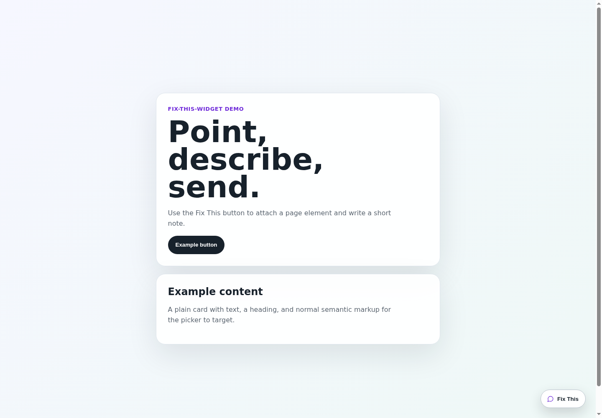

# Official "Fix This"-Widget

Let users say "fix this" while they are looking at the broken thing.

`fix-this-widget` is a tiny React feedback widget for product teams, indie builders, and internal tools where vague bug reports are expensive. Users click a floating button, write a short note, optionally point at the exact UI element, and your app receives the context needed to fix it.

That context is also useful input for coding agents: specific page, specific element, human note, and bounded metadata. Good enough to queue, triage, and hand to an AI-assisted fix loop.

No screenshots. No full DOM dump. No feedback portal ceremony.



## why this exists

Most product feedback gets worse as it travels.

> "The button is weird."
> "This page broke."
> "I don't know what happened."

That usually means another round trip: which page, which button, what browser size, what were you looking at?

`fix-this-widget` captures the useful bits at the moment of frustration:

- the user's note
- optional email
- current page URL and title
- viewport size
- timestamp
- optional selected element metadata
- safe nearby context for the selected element

You get a compact fix request instead of a detective job.

## install

```bash
npm install fix-this-widget
```

Add the widget and stylesheet:

```tsx
import { FixThisWidget } from 'fix-this-widget';
import 'fix-this-widget/styles.css';

export function App() {
  return <FixThisWidget />;
}
```

By default, feedback posts to `/api/fix-this-widget/feedback`.

## 2-minute backend

For Next.js App Router, add this route:

```ts
// app/api/fix-this-widget/feedback/route.ts
import { createFixThisWidgetHandler } from 'fix-this-widget/server';

export const POST = createFixThisWidgetHandler();
```

That appends each request to `feedback/fix-this-widget.jsonl` relative to your app working directory.

Want a different file?

```ts
export const POST = createFixThisWidgetHandler({
  filePath: 'data/feedback.jsonl',
});
```

Want to send feedback to your own API, database, Linear, GitHub Issues, Slack, or queue? Pass `submitFeedback`:

```tsx
<FixThisWidget
  submitFeedback={async (payload) => {
    const response = await fetch('/feedback', {
      method: 'POST',
      headers: { 'Content-Type': 'application/json' },
      body: JSON.stringify(payload),
    });

    if (!response.ok) throw new Error('Feedback submission failed');
  }}
/>
```

The callback may resolve with `void` or any host response. The widget only needs success or failure.

## what you receive

A feedback payload looks roughly like this:

```json
{
  "source": "fix_this_widget",
  "note": "This CTA is confusing",
  "email": "user@example.com",
  "page": {
    "url": "https://example.com/pricing",
    "title": "Pricing"
  },
  "viewport": {
    "w": 1280,
    "h": 720
  },
  "element": {
    "label": "Start trial",
    "type": "Button",
    "selector": "[data-feedback-id=\"start-trial\"]",
    "selectorCandidates": ["[data-feedback-id=\"start-trial\"]", "button:nth-of-type(1)"],
    "text": "Start trial"
  },
  "ts": "2026-06-03T00:00:00.000Z"
}
```

Enough context to act. Not enough to become creepy.

## agentic feedback loops

The payload is intentionally shaped so a human team or coding agent can do something useful with it.

A practical loop looks like this:

1. Run the widget in an internal build for your whole team.
2. Store each fix request as JSONL, a database row, or an issue.
3. Feed the note, page metadata, and selected element metadata into your agent workflow.
4. Let the agent propose or open a small fix.
5. Review, merge, deploy, and keep collecting sharper feedback.

This is the boring version of agentic product improvement: real users point at real UI, the system captures enough context, and automation gets a concrete task instead of vibes.

Start with internal teamwide testing. If the loop is good, open it to beta users. Put it in public production if you dare :P

## element picker

The element picker works without marking up your app. Users can point at an element and the widget attaches bounded metadata for that target.

The picker looks for the best stable selector it can find:

- `data-feedback-id`
- test IDs
- `id`
- `aria-label`
- `name`
- a short tag-path fallback

The attached element payload includes:

- `label`: readable label for the target
- `type`: coarse target type, such as `Button`, `Link`, `Input`, or `Card/Section`
- `selector`: best selector candidate
- `selectorCandidates`: fallback selector candidates
- `text`: normalized visible text, capped at 80 characters
- `context`: bounded sanitized snippets for the target and, when useful, a nearby landmark parent

You can add `data-feedback-id` to important UI elements for extra precision, but it is optional.

## privacy by default

The widget is deliberately boring in the right places.

It does not capture screenshots. It does not serialize the full page DOM. It does not collect class names, styles, arbitrary `data-*` attributes, or hidden markup.

It only sends bounded metadata that helps identify the selected element: label, type, selector candidates, short visible text, and sanitized nearby context.

## styling

The stylesheet is required:

```tsx
import 'fix-this-widget/styles.css';
```

Customize it with namespaced CSS custom properties:

```css
.fix-this-widget {
  --fix-this-widget-primary: #7c3aed;
  --fix-this-widget-primary-hover: #6d28d9;
  --fix-this-widget-surface: #fff;
  --fix-this-widget-radius-xl: 24px;
}
```

## props

| Prop | Type | Default | Description |
| --- | --- | --- | --- |
| `submitFeedback` | `(payload) => Promise<void \| unknown>` | POST to `/api/fix-this-widget/feedback` | Override where feedback is sent. |
| `enableElementPicker` | `boolean` | `true` | Lets users point to the page element they want fixed. |
| `collectEmail` | `boolean` | `true` | Shows the optional email field. Set `false` to collect notes only. |
| `feedbackSource` | `string` | `fix_this_widget` | Labels submitted feedback for your backend or analytics pipeline. |
| `getContext` | `() => Partial<FixThisWidgetContext>` | page URL, title, viewport, timestamp | Adds or overrides page, viewport, timestamp, request ID, or session ID fields. |
| `footerContext` | `ReactNode` | `undefined` | Optional helper/context copy rendered below the submit button. |
| `footerSelector` | `string` | `footer, [role="contentinfo"]` | Keeps the floating widget above normal semantic footers. |

## exports

- `fix-this-widget`: React component and TypeScript types
- `fix-this-widget/styles.css`: CSS sidecar required for the widget UI
- `fix-this-widget/element-metadata`: element metadata helper for tests or host adapters
- `fix-this-widget/server`: JSONL storage helpers for the default endpoint

## requirements

- React `>=18.2.0 <21.0.0`
- A client-rendered React surface. In Next.js App Router, render the widget from a client component.
- A POST endpoint at `/api/fix-this-widget/feedback` if you use the default JSONL storage path.
- A Node/server runtime with a writable filesystem for default JSONL storage. Use `submitFeedback` for serverless, database, or external storage.

## example apps

Two Vite examples live under [`examples/`](./examples):

```bash
npm run example-simple
npm run example-full
```

`npm run example` is an alias for `npm run example-simple`.

The examples use the local package via `file:../..`:

- [`examples/example-simple`](./examples/example-simple): renders `<FixThisWidget />` with the default endpoint.
- [`examples/example-full`](./examples/example-full): passes every adjustable widget prop:

```tsx
<FixThisWidget
  submitFeedback={submitFullConfigFeedback}
  footerSelector=".full-config-footer"
  enableElementPicker={true}
  collectEmail={true}
  feedbackSource="full_config_example"
  getContext={getFullConfigContext}
  footerContext={<span>Custom helper copy for the form footer.</span>}
/>
```

Each Vite dev server wires its feedback endpoint to the package JSONL helper. Submissions are written under that example's local `feedback/` directory.

## development

```bash
npm install
npm test
npm run typecheck
npm run lint
npm run build
npm pack --dry-run --json
```

`npm run build` emits ESM JavaScript, declaration files, server helpers, and `dist/styles.css`.

For release commands, see [RELEASE.md](./RELEASE.md).
